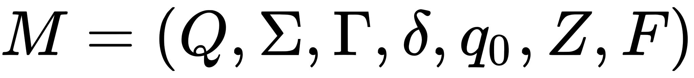
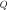
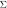
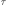
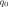
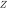
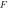
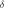

# Pushdown Automaton Simulator
This is a simple simulator of a pushdown automaton, 
built in java programming language.

This is a project for the subject **Computational Complexity** 
of the Computer Engeneering degree 
at [La Laguna University](https://www.ull.es).

## Introduction
An *automaton* is formal machine, whose function is to determine if 
a string is contained in a certain type of formal language.

Formally, an automaton is built of states and transitions. Each state
represents where is the automaton in the processing of the
input string.

In the study of *abstract machines*, which is a subject of discrete maths
and computer science, it exists a wel-known classification of automatons
and formal languages that could recognize each automaton. 
This classification is called **Chomsky Hierarchy**.

| Grammar |        Language        |                    Automaton                    |
|:-------:|:----------------------:|:-----------------------------------------------:|
|  Type-0 | Recursively enumerable |                  Turing machine                 |
|  Type-1 |    Context sensitive   | Linear-bounded non-deterministic Turing machine |
|  Type-2 |      Context free      |                Pushdown automaton               |
|  Type-3 |    Regular language    |               Finite state machine              |


As we can see it exist a classification depending on the expressivity
power of each automaton. Therefore, each language and automaton has 
its own properties and definitions. In this programme we are simulating 
a **Pushdown Automaton**, which is used to recognize strings 
belonging to context free languages.

## Definition of a pushdown automaton
As we say before, pushdown automaton is a special kind of automaton
that employs a stack for working.

### Informal description
The pushdown automaton is very similar to a finite state machine,
but with an important difference: the use of an stack.

The processing of the string of a pushdown automaton goes like
this:

1. Reads the current symbol of the input string or tape.
2. Depending on the read symbol, the top symbol of the stack
and the current state where the automaton is placed it takes
a decision of which state is going to go.
3. This process is executing until all the string has been 
explored or where the stack is empty.

It is important to say that this automaton is nondeterministic,
so many transitions should be explored for the same combination
of states and symbols.

### Formal description

Formally the pushdown automaton is defined as a *7-tuple* 
of elements: 

consist on this elements: 

*  : finite set of states of the automaton.
*  : alphabet of the input tape, 
which is a finite set of symbols.
*  : alphabet of the stack, 
which is a finite set of symbols.
*  : initial state of the automaton.
*  : initial symbol of the alphabet.
*  : finite set of accepting states.
*  : Transition function of the automaton.


## Usage
For executing the program you should do

```
    java -jar PushdownAutomaton.jar [log] AutomatonDefinition.txt TapeDefinition.txt
```

 Where parameters mean:

 * log : If this option is included is going to show a trace mode.
 * AutomatonDefinition.txt : Definition of the automaton of acceptance states.
 * tapeDefinition.txt : Optional definition of the tape.


## Tape
The tape (input string) should have the symbols separated by spaces.

## Example use
This is an example of an execution:

```
Q = {p, q, r}
Σ = {a, b}
τ = {A, S}
s = p
z = S
F = {r}
δ :
(p, a, S) → (p, [A])
(p, b, A) → (q, [ε])
(p, a, A) → (p, [A, A])
(q, b, A) → (q, [ε])

Enter the tape input >
a a b b
-----------------------------------------------------------------------------
| used transition           | state | word (ω)  | stack           | transitions
-----------------------------------------------------------------------------
| -                         | p     | a a b b $ | [S]             | (p, a, S) → (p, [A])
| (p, a, S) → (p, [A])      | p     | a b b $   | [A]             | (p, a, A) → (p, [A, A])
| (p, a, A) → (p, [A, A])   | p     | b b $     | [A, A]          | (p, b, A) → (q, [ε])
| (p, b, A) → (q, [ε])      | q     | b $       | [A]             | (q, b, A) → (q, [ε])
| (p, a, S) → (p, [A])      | q     | $         | []              | ω ∈ L

String a a b b $ belongs to the language generated by the automaton.

```

## Author

* **Cristian Abrante Dorta** - [CristianAbrante](https://github.com/CristianAbrante)
